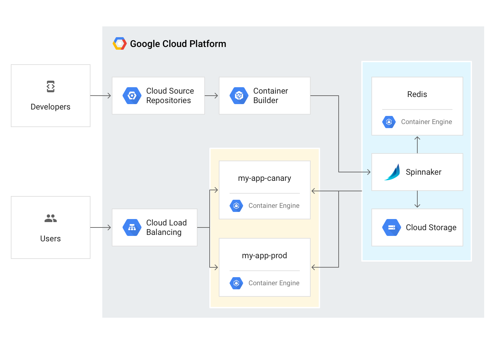
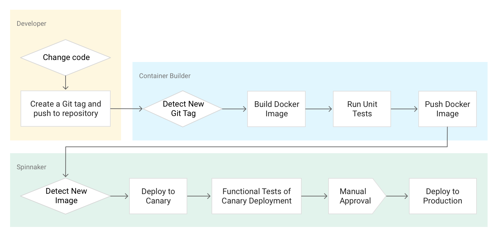

# GKE Info 

| Test          |   Result      |
| ------------- |---------------|
| Tutorial      |  |
| Build App     | |

# Continuous Delivery with Spinnaker and Kubernetes

This tutorial takes you through the process of creating a reliable and robust continuous delivery pipeline using Google Container Engine (GKE), Google Cloud Source Repositories (GSR), Google Cloud Container Builder (GCB), and Spinnaker. You deploy your code changes in an automated fashion with the ability to quickly roll back your deployments. Below is a high level architecture diagram of the services you use and software you deploy to accomplish this: 

To continuously deliver updates to your users, you will need to create an automated process that can reliably build, test and update your software. Changes to your code should be automatically taken through a pipeline that includes artifact creation, unit testing, functional testing and production roll out. In some cases you will want to have code hit a subset of your users so that it is being exercised in a realistic way before being rolled out to your entire fleet of machines. This procedure, canary releases, is facilitated by having the ability to quickly rollback software changes that do not provide the intended results.

With Container Engine and Spinnaker we can create a robust continuous delivery flow that ensures we can ship software as quickly as it can be developed. Although our end goal is to be able iterate quickly, we must ensure that each code change passes through a gamut of automated validations and tests before becoming a candidate for production roll out. Once the change has been sufficiently vetted through automation, you may want to do some manual validation or further testing against the software. After it has been deemed “production-ready”, one of your team members can approve it for production deployment. 

In this tutorial, you will build the following pipeline:

## Labs

1. [Workshop Setup](labs/workshop-setup.md)
1. [Installing Spinnaker](labs/installing-spinnaker.md)
1. [Building Container Images](labs/building-container-images.md)
1. [Creating Your Pipeline](labs/creating-your-pipeline.md)
1. [Triggering Deployments](labs/triggering-deployments.md)
1. [Workshop Cleanup](labs/workshop-cleanup.md)

## What Next?

* PLACEHOLDER
