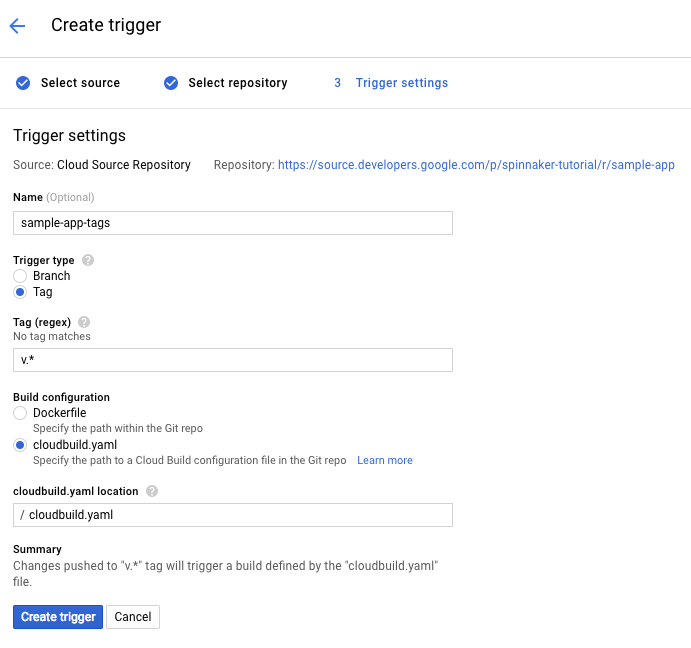

# Building the Docker Image

In this lab, we'll use a build trigger to connect Google Source Repository to Google Container Registry.
After this module, whenever we tag an image for release, we'll automatically kick off a spinnaker deployment.

## Creating your Source Code Repository

1. Download the source code:

    ```source
    wget https://gke-spinnaker.storage.googleapis.com/sample-app.tgz
   ```

1. Unpack the source code
  
    ```shell
    tar xzfv sample-app.tgz
    ```

1. Go into the source code directory

    ```shell
    cd sample-app
    ```

1. Set the username and email address for your Git commits in this repository.

    > **NOTE:** Replace [EMAIL_ADDRESS] with your Git email address.

    ```shell
    git config --global user.email "[EMAIL_ADDRESS]"
    ```

    > **NOTE:** Replace [USERNAME] with your Git username.

    ```shell
    git config --global user.name "[USERNAME]"
    ```

1. Make the initial commit to your source code repository

    ```shell
    git init
    git add .
    git commit -m "Initial commit"
    ```

1. Create a Cloud Source Repository to host your code

    ```shell
    gcloud source repos create sample-app
    git config credential.helper gcloud.sh
    ```

1. Add your newly created repository as a remote:

    ```shell
    export PROJECT=$(gcloud info --format='value(config.project)')
    git remote add origin https://source.developers.google.com/p/$PROJECT/r/sample-app
    ```

1. Push your code to the new repository’s master branch

    ```shell
    git push origin master
    ```

You should be able to see your source code in the console:
https://console.cloud.google.com/code/develop/browse/sample-app/master

## Configuring your Container Builder Triggers
In this section, you will configure Container Builder to build and push your images every time there is a Git tag pushed to your source repository. Container Builder will automatically check out your source code, build the Docker image from the Dockerfile in your repo and then push that image to Google Container Registry.


In the Google Cloud Console, set the build trigger to: 
 'Changes pushed to "v.*" tag will trigger a build of "gcr.io/YOUR-PROJECT-NAME/$REPO_NAME:$TAG_NAME"'

1. Go to the Build Triggers UI in the Cloud Console
1. Select Cloud Source Repository, then click Continue
1. Select your newly created sample-app repository from the list and click ‘Continue’
1. Set the following parameters in the trigger configuration page:
  Name: sample-app-tags
  Trigger Type: Tag
  Tag (regex): v.*
  Build Configuration: cloudbuild.yaml
  cloudbuild.yaml location: cloudbuild.yaml
  
1. Click “Create Trigger”


Now any Git tag with prefixed with the letter “v” that gets pushed to your repository will get built automatically as an image. Push your first image by doing the following:
1. Go to your source code folder in Cloud Shell
1. Create a git tag:

    ```shell
    git tag v1.0.0
    ```

1. Push the tag

    ```shell
    git push --tags
    ```

1. In the Container Builder Build History console you should see a build has been triggered:


## What's Next

Now that you have set up build triggers to create application container images, it's time to create a Spinnaker pipeline that consumes those images and deploys them through our CI/CD pipeline.
